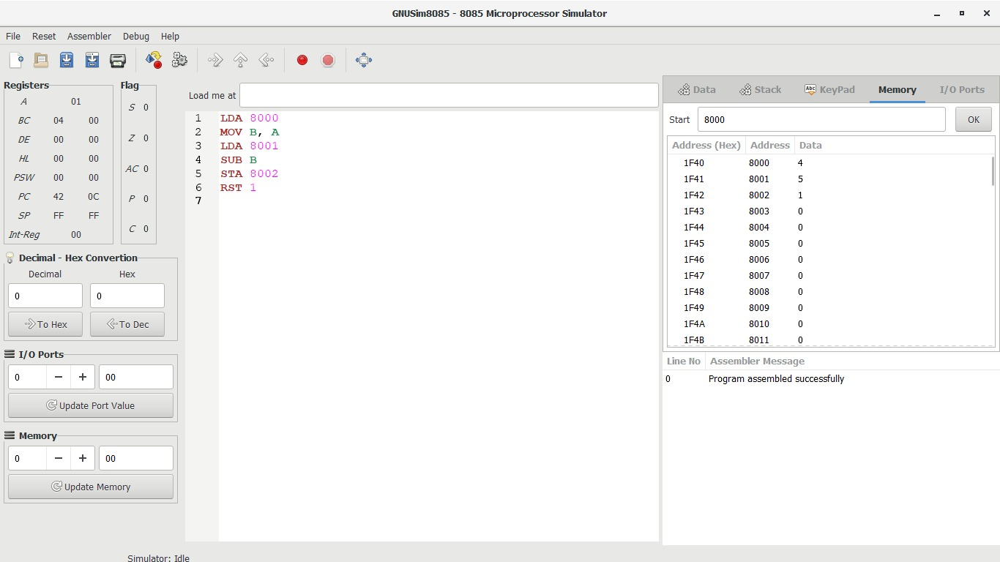
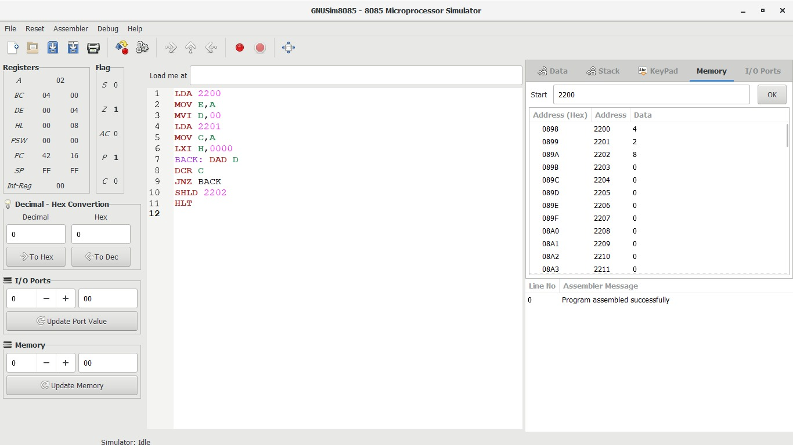

# 💻 Computer-architecture
🎓 **Register Number:** 192424081  
🤗 **NAME:** THARANKESWARAN 
## 8085-microprocessor

### 1️⃣ ADDITION

```assembly
LDA 8050  
MOV B, A  
LDA 8051  
ADD B  
STA 8052  
HLT  
```
Input 

8050 `1`
      
8051 `2`

Output 

8053 `3`
### 2️⃣ SUBTRACTION


### 3️⃣ MULTIPLICATION



### 4️⃣ DIVISION

